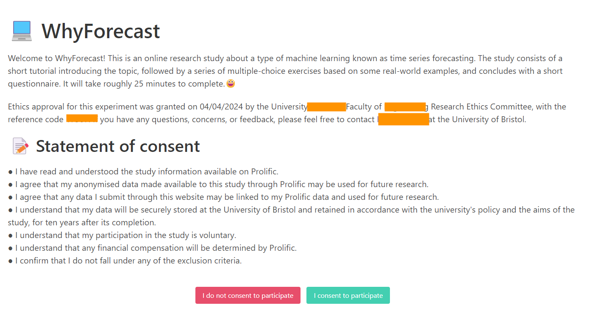
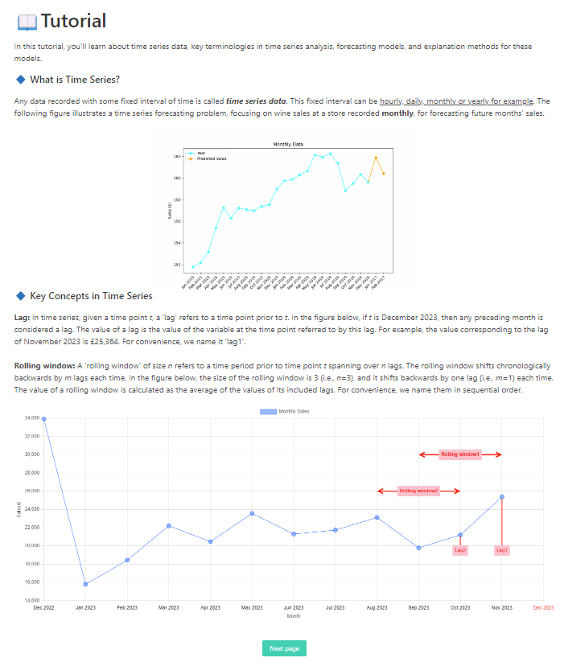
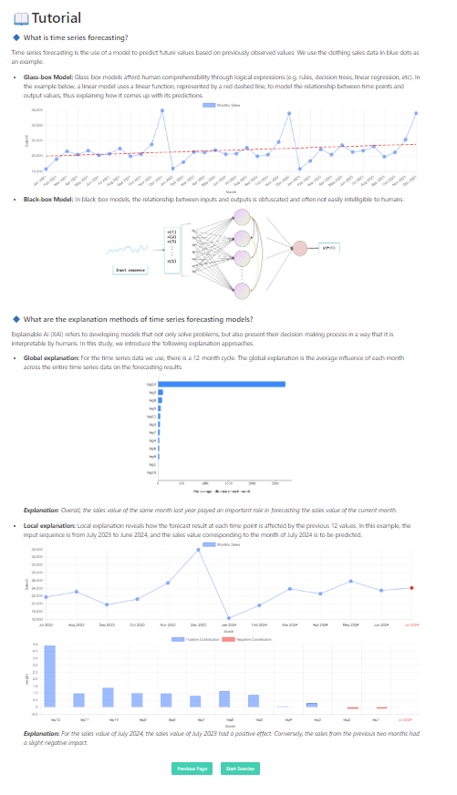

# :sunglasses: WhyForecast
This GitHub repository provides supplementary materials and source code for the paper titled 'TSFeatLIME: An Online User Study in Enhancing Explainability in Univariate Time Series Forecasting.' These resources are intended to support and extend the research findings presented in the paper.

## :pushpin: Prolifc study interface
This is the template for conducting studies using the Prolific academic research platform. It helps handle complex tasks including session management, participant verification from Prolific, and persistent data storage for the study. 

Links of treatment and control group [Obey the policy of double-blind review, full links will be made public upon decision notification.]:

- **Treatment group:** https://whyforecast1.xxx-xai.uk/consent?prolific_id=[Prolific_ID]
- **Control group:** https://whyforecast.xxx-xai.uk/consent?prolific_id=[Prolific_ID]
  
Note: Replace [Prolific_ID] with the actual Prolific ID of each participant. 

### :one: Getting Started

To begin using this project, you will need to install the dependencies listed in the `requirements.txt` file. If you're using a Mac with an M-series processor, you might encounter some difficulties while installing the `cryptography` package.

### :two: Running the Study

To configure your study, you will need to modify a TOML configuration file. A template for this file, named `template.toml`, is provided. It is important to properly configure the `debug` option. During development, it's recommended to set `debug` to `false` to avoid complications arising from server configurations. Once the configuration file is ready, you can initiate the study using the following command:

```bash
python3 study_server/main.py --debug --config <path to config file> ...
```

The study allows templates for all components such as the consent, study, survey, and completion HTML. All of these need to be provided, for example:
```bash
... --db study.db --consent consent.html --study study.html --survey survey.html --complete complete.html
```
To view all available command line options at any point, you can use:
```bash
python3 study_server/main.py --help
```
The core part of the study occurs at the `/study` endpoint. The way the system interacts with this endpoint is defined in the `resources.py` file in the `StudyResource` class. If necessary, you can extend this class with additional code or files to support your specific study requirements.

## :pushpin: Dataset Overview

### :one: Dataset
Superstore Sales Dataset
- **Source:** Community.tableau.com (2017)
- **Period:** 2014 to 2017
- **Data Points:** Nearly 10,000
- **Features:** 21 distinct features across three primary sales categories: furniture, technology goods, and office supplies.
- **Focus Area:** Furniture sales due to their pronounced seasonal fluctuations.
  
Spanish Electricity Market Dataset
- **Source:** [Kaggle - Spanish Electricity Market](https://www.kaggle.com/datasets/manualrg/spanish-electricity-market-demand-gen-price)
- **Period:** 2014 to 2018
- **Resampling:** Data resampled on a monthly frequency using average daily consumption values.
- **Focus Area:** Forecasting electricity demand.

### :two: Data Partitioning

For time series data, using a simple random split into training and testing sets is untenable as it doesn't respect the temporal order and can lead to data leakage. Instead, the data must be split temporally to preserve its chronological integrity.


| Dataset         | Training Period         | Testing Period        |
|-----------------|-------------------------|-----------------------|
| Sales           | 2014.01.01 - 2016.12.01 | 2017.01.01 - 2017.12.01|
| Consumption     | 2014.01.01 - 2017.12.01 | 2018.01.01 - 2018.12.01|

## :pushpin: Univariate time series forecasting results
We have supplemented the results of the experiments for training the black box models. The **stacked LSTM** emerges as the superior model for furniture sales forecasting, while the **Vanilla LSTM** excels in electricity consumption forecasting.


| Dataset      | Time Series Model  | RMSE       | MAPE     |
|--------------|--------------------|------------|----------|
| **Sales**    |                    |            |          |
|              | SARIMA             | 205.68     | 28.89%   |
|              | TES                | 204.83     | 27.81%   |
|              | Prophet            | 167.29     | 22.62%   |
|              | Vanilla LSTM       | 146.45     | 19.01%   |
|              | Stacked LSTM       | 145.07     | 18.47%   |
|              | Bidirectional LSTM | 203.50     | 21.04%   |
|              | CNN                | 202.47     | 20.67%   |
| **Electricity** |                 |            |          |
|              | SARIMA             | 12334.76   | 7.95%    |
|              | TES                | 11065.90   | 7.40%    |
|              | Prophet            | 10785.78   | 6.74%    |
|              | Vanilla LSTM       | 9885.90    | 5.85%    |
|              | Stacked LSTM       | 10454.84   | 6.24%    |
|              | Bidirectional LSTM | 12575.76   | 7.66%    |
|              | CNN                | 12048.25   | 7.41%    |


## :pushpin: Interface screenshot
The interface consists of four parts. The paper has already provided a screenshot of the 'exercise' section. Here, we will supplement it with the consent page and tutorial page. The questionnaire section is presented in tabular form below.

Figure 1 displays the consent page. The tutorial consists of two pages. Participants will learn about time series data, key terminology in time series analysis, forecasting models, and methods for explaining these models. Figures 2 and 3 show the contents of the tutorial.

<p align="center">
  
</p>
Figure 1: Consent Page

<p align="center">
  
</p>
Figure 2: Tutorial Page1

<p align="center">
  
</p>
Figure 3: Tutorial Page2


## :pushpin: Questionnaire for control and treatment group

| Category                                    | Question                                                                                     | Options                                             |
|---------------------------------------------|---------------------------------------------------------------------------------------------|-----------------------------------------------------|
| **Basic Information**                      | **Q1:** Do you have a STEM background? (STEM stands for science, technology, engineering, and mathematics) | Yes, No                                            |
|                                             | **Q2:** Do you have machine learning experience?                                            | Yes, No                                            |
|                                             | **Q3:** Do you have any prior time series forecasting experience?                            | Yes, No                                            |
| **System satisfaction & The helpfulness of explanations** | **Q4:** How difficult was it for you to understand the concepts of lag and rolling window? | Five levels from Very easy to Very hard            |
|                                             | **Q5:** Do you find the global explanation helps you understand time series prediction?      | Five levels from Very helpful to Not very helpful  |
|                                             | **Q6 [Treatment]:** Which explanation conveys useful information when doing your prediction?| Lag, Rolling window, I don't think they are helpful, Both are helpful |
|                                             | **Q6 [Control]:** Would you have liked to have some local explanations about your wrong answer? | Yes, No                                        |
|                                             | **Q7:** Our exercises simulate a scenario where changing certain values leads to specific events, and local explanations provide insights into such cases. Do you think this would be helpful in real-world applications? | Five levels from Very helpful to Not very helpful |
|                                             | **Q8:** What is your overall experience with this study?                                     | Five levels from Very satisfied to Not very satisfied |
| **Curiosity & Trust**                       | **Q9 [Treatment]:** I wanted to understand how time series forecasting works, and this study helped me to achieve this to some extent. | Five levels from I agree strongly to I disagree strongly |
|                                             | **Q9 [Control]:** I wanted to understand how time series forecasting works.                  | Five levels from I agree strongly to I disagree strongly |
|                                             | **Q10 [Treatment]:** I feel the explanations have enhanced my confidence in AI systems in general. | Five levels from I agree strongly to I disagree strongly |
|                                             | **Q10 [Control]:** I feel the explanations will enhance my confidence in AI systems in general. | Five levels from I agree strongly to I disagree strongly |
|                                             | **Q11:** I believe good XAI tools will help the adoption of AI technologies.                 | Five levels from I agree strongly to I disagree strongly |
| **Overall feedback**                        | **Q12 [Treatment]:** Could you provide a description of how you complete exercises based on the explanation? | Your response |
|                                             | **Q12 [Control]:** Have you encountered any challenges while using the explanation?         | Your response                                       |
|                                             | **Q13:** Do you have any additional comments or feedback?                                   | Your feedback                                       |


## :pushpin: Link to the exercise and questionnaire results
We have recruited participants for the control and treatment groups via Prolific to complete our experiment. Data from the surveys and experimental results are included in the link: https://osf.io/gy7qc/. Please note that all personally identifiable information has been removed.


